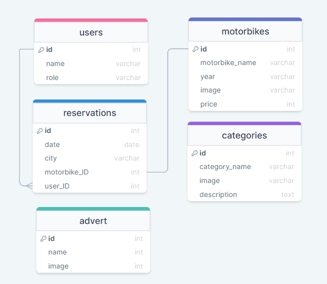

# Motorbike Booking Back-End

> Motorbike Booking is a rails backend application for booking Motorbikes. This application serves as API endpoints for the frontend and users can load, create, and delete Motorbikes, as well as add reservations. Users need to sign up or sign in to access the API endponits. They can sign up or sign in using the API endponts.

## Schema


### Front-End Repository

[Motorbike Booking Frontend](https://github.com/RWUBAKWANAYO/motorbike_booking_frontend)

### Kanban Board
[Kanban Board](https://github.com/RWUBAKWANAYO/motorbike_booking_backend/projects/1)

> ***We are a group of five***
1. Member 1 - [Pedro](https://github.com/ppmarq1)
2. Member 2 - [Joseph](https://github.com/Kwentsir)
3. Member 3 - [Emmanuel](https://github.com/Epaltechs)
4. Member 4 - [Ghilain](https://github.com/Ghilain)
5. Member 5 - [Olivier](https://github.com/RWUBAKWANAYO)

## Built With

- Major languages (Ruby)
- Framworks (Ruby on Rails)
- Testing library (Rspec)
- API docs (Rswag)

## Live version

[In progress]

## Getting Started

To get a local copy up and running follow these simple example steps.

### Prerequisites
- A text editor(preferably Visual Studio Code)

### Install
- Ruby
- Ruby on Rails
- PostgresSQL

### Using it Locally

- Clone the project
```
git clone https://github.com/RWUBAKWANAYO/motorbike_booking_backend
cd motorbike_booking_backend
```

### Setup

Add your username & password in `database.yml` file:
```
username: <your_username>
password: <your_password>
```
Specify your ruby version if different from mine
```
ruby 'Your_ruby_version'
```

Install gems with:

```
bundle install
```

Setup database with:

```
rails db:create
rails db:migrate
rails db:seed
```
### Usage

Start server with:

```
rails server -p 3000
```

Visit http://localhost:3000/ in your browser.

### Run tests

Install npm with:

```
npm install
```

Install rspec with:

```
bundle install
```

and

```
rails generate rspec:install
```

run the test with:

```
rspec spec
```
### Open API documentation

```
rails rswag:specs:swaggerize
```

Visit http://localhost:3000/api-docs in your browser.

## Visit And Open Files

[Visit Repo](https://github.com/RWUBAKWANAYO/motorbike_booking_backend)


## Authors

👤 **Olivier**

- GitHub: [@Rwubakwanayo](https://github.com/RWUBAKWANAYO)
- Twitter: [@Rwubakwanayo](https://twitter.com/rwubakwanayo
)
- LinkedIn: [Rwubakwanayo Oliver](https://www.linkedin.com/in/rwubakwanayo-olivier)

👤 **Pedro**

- GitHub: [Pedro](https://github.com/ppmarq1)
- Twitter: [@ppmarq1](https://twitter.com/ppmarq1)
- LinkedIn: [@Pedro](https://br.linkedin.com/in/pedroalmeidamarques/)

👤 **Joseph**

- GitHub: [@Kwentsir](https://github.com/Kwentsir/)
- Twitter: [@jkwentsir](https://twitter.com/jkwentsir)
- LinkedIn: [@Joseph Kwentsir](https://www.linkedin.com/in/josephkwentsir/)

👤 **Ghilain**

- GitHub: [@Ghilain Ishimwe](https://github.com/Ghilain)
- Twitter: [@GhilainIshime](https://twitter.com/GhilainIshimwe)
- LinkedIn: [@Ghilain Ishimwe](https://www.linkedin.com/in/ghilain-ishimwe/)

👤 **Emmanuel**

- GitHub: [@Epaltechs](https://github.com/Epaltechs)
- Twitter: [Emmanuel Paul](http://twitter.com/@emmapaul247)
- LinkedIn: [Emmanuel Paul](https://www.linkedin.com/in/emmanuel-s-paul)

## 🤝 Contributing

Contributions, issues, and feature requests are welcome!

Feel free to check the [issues page](https://github.com/RWUBAKWANAYO/motorbike_booking_backend/issues).

## Show your support

Give a ⭐️ if you like this project!

## Acknowledgments
-  We acknowledge with appreciation the original design provided by Murat Korkmaz on Behance.
- Inspiration: Microverse

## 📝 License

This project is [MIT](./LICENSE.md) licensed.
